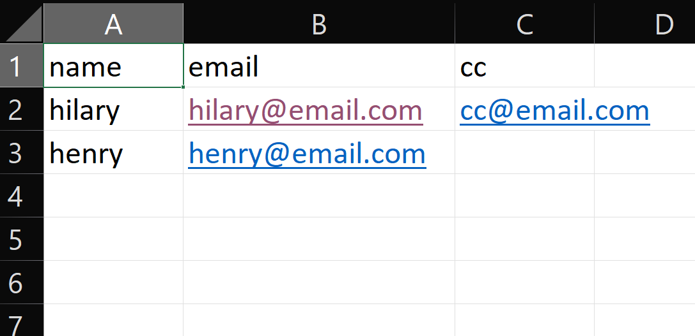

# python-emailer
python-emailer: a python emailing toolkit

## What is it?
python-emailer is a Python package that aids in sending of emails. It is a robust package which aims to cover every aspect of sending emails thereby, helping developers code less.

## Typical Usage
```python
from python_emailer.email_processing import PyMailer

login_details = ['sender_email', 'password']

email_sender = PyMailer('recipient_data.csv', login_details, 
                        subject='Job Application', 'Find attached my cv')

email_sender.send_email(file_path='cv.pdf')

```
## Main Features
Here are some of the supported features of python-emailer:
* Checks and cleans common errors in email addresses like ( unexpected spaces, fullstops).
* Checks for valid email address syntax
* Reads email content from strings, .html files, or .txt files
* Reads recipient data from string, list, tuple, set, dictionary, .json, and .csv files.
* Auto detects the SMTP host of the provided sender email address.
* Attaches files to the email. Can also attach all files in a given directory. Can also display files(images) in the email.
* Auto detects the message type of the email(html or plain)
* Includes recipient's name in the email after the provided introductory string(i.e Hello <recipient_name>)

## Where to get it
The source code is hosted on Github: https://github.com/hilariie/python-emailer

And can be installed from Python Package Index(PyPI)

```
pip install python-emailer
```

## Dependencies
This package only makes use of python builtin packages.

## License
[MIT](LICENSE)

## Contributing
Contributions, bug reports and fixes, documentation improvements and enhancements, and ideas are all welcome.

To contribute:
* Fork this repo
* Clone your repo

    `git clone <your repo>`
* Make commit changes

    `git add <changed files>`
    
    `git commit -m "commit message`
* Push changes

    `git push ..`
* Create a pull request

## How to use
#### File attachments:
To attach files to an email, provide the path to the files to the `file_path` argument of `send_email`
___
For a `cv.pdf` file.

```python
...
send_email(file_path='C:\\email\\attachments\\cv.pdf')
```

To attach multiple files, pass the directory instead

```python
...
send_email(file_path='C:\\email\\attachments')
```

To display images in email, make sure you have cid:<image_name> in your email content/message where you want to display the image.
An example is shown below

```python
Hello, 
    <p>Below is the order of the meetup</p>
    <p>
    
    </p>
```

pass in the exact cid value in the send_email method

```python
send_email(cid_img='image_test')
```
___

#### Greeting:
For multiple recipients (names and email addresses) where you wish to address them by names,simply pass the greeting string.


```python
send_email(greeting='Hello')
```

email appears as:

`Hello <recipient_name>`

`Email body`
___

#### Recipient data:
Recipient data can be read from various data and file types such as

* sets - recipient email addresses
* lists - recipient email addresses
* tuples - recipient email addresses
* dictionaries - recipient email addresses, names, and cc
* string - recipient email addresses
* .json files - recipient email addresses, names, and cc
* .csv files - recipient email addresses, names, and cc

##### .csv files:
csv files should be arranged in this order below


##### .json files/dictionaries
Dictionaries should be in one of the two structures
- {names:[name1, name2, ...], emails:[email1, email2, ...], cc:[cc1, cc2, ...]}
- {name1:email1, name2:email2, ...}